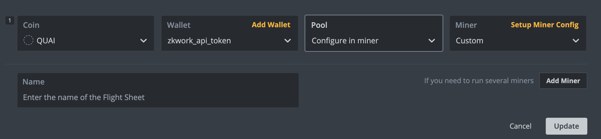
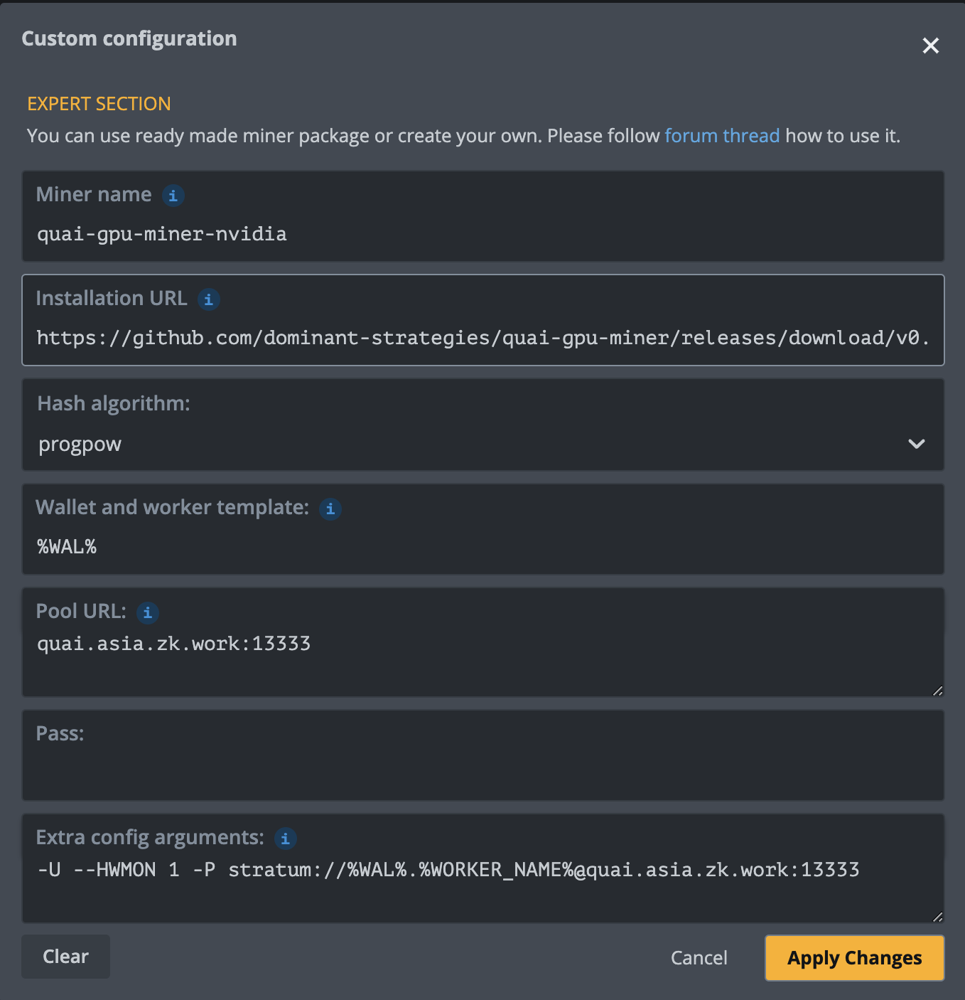
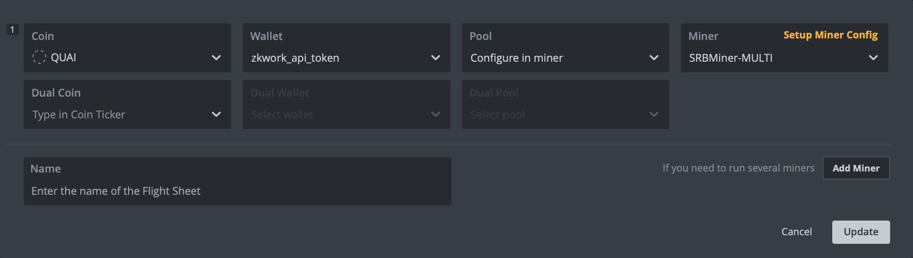
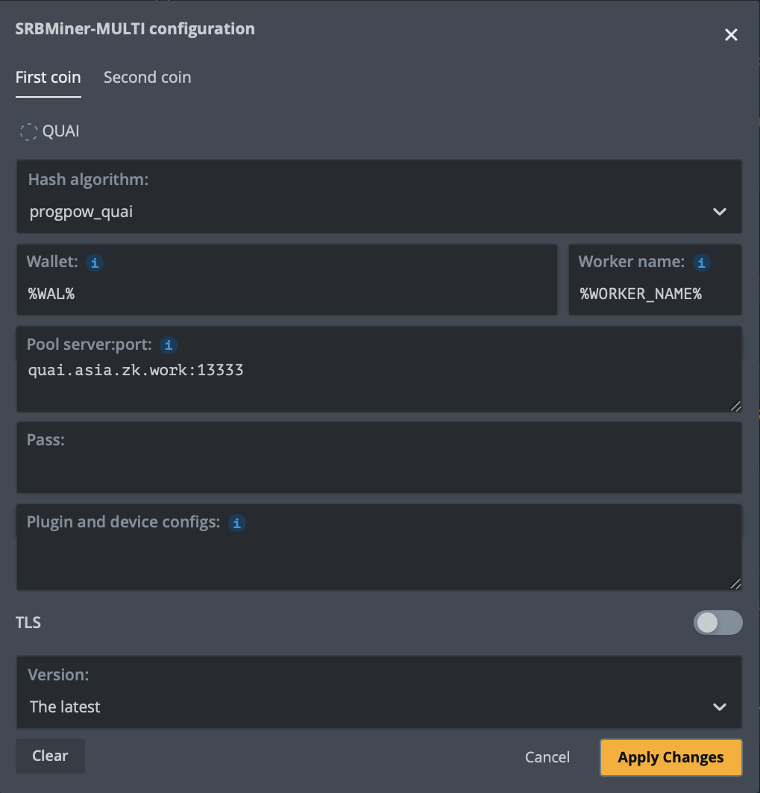
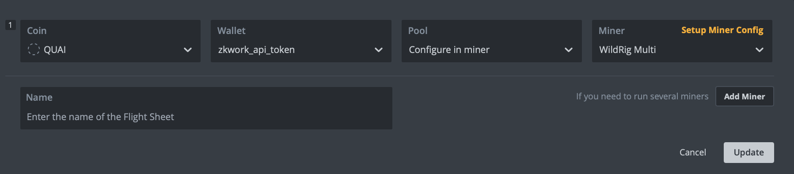
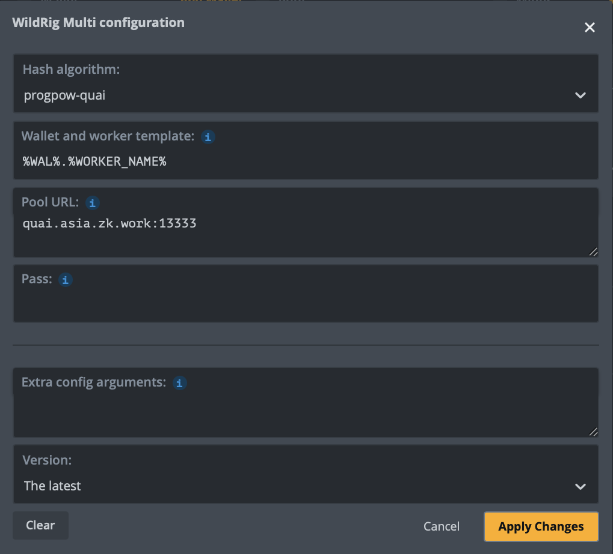
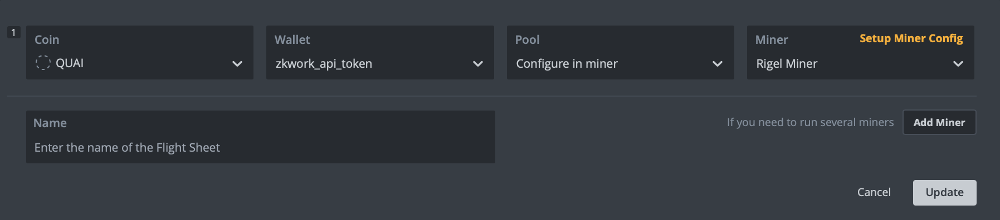
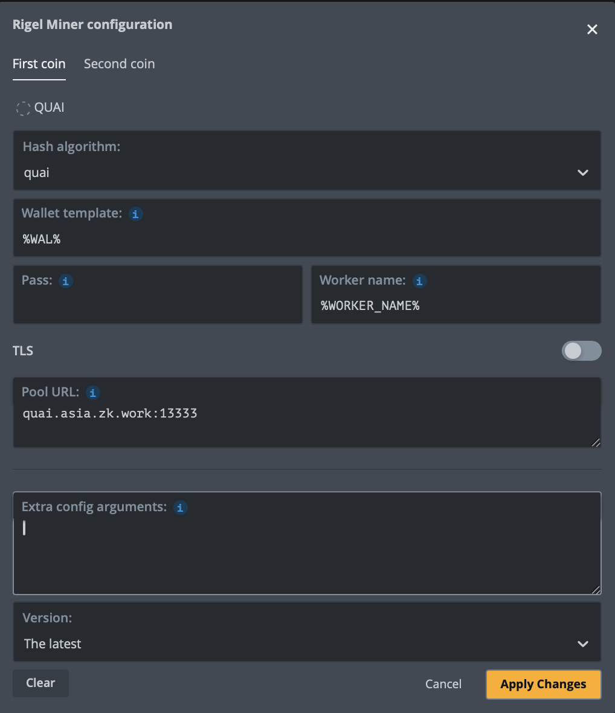

# ZKWROK_QUAI_MINING
 ## Pool stratum servers:
 * quai.asia.zk.work:13333
 * quai.eu.zk.work:13333

## Mining Tutorial
**Supported Miners**
  
| Miner Name       | Download                                      | Setup Guide                                   |
|------------------|-----------------------------------------------|-------------------------------------------------|
| Rigel            | https://github.com/rigelminer/rigel                            | [Configuration](#rigel)             |
| SRBMiner         | https://github.com/doktor83/SRBMiner-Multi/releases            | [Configuration](#srbminer)          |
| WildRig          | https://github.com/andru-kun/wildrig-multi                     | [Configuration](#wildrig)           |
| Quai GPU Miner   | https://github.com/dominant-strategies/quai-gpu-miner/releases | [Configuration](#quai-gpu-miner)    |
  

### quai_gpu_miner

- Version: [v0.5.0+](https://github.com/dominant-strategies/quai-gpu-miner/releases)

**On Ubuntu**

1. Get a ZKWORK_API_TOKEN on [ZK.WROK](https://v2.zk.work/).
2. Download quai gpu miner: https://github.com/dominant-strategies/quai-gpu-miner/releases.
3. Create a script: `vi quai_mining.sh`.
    ```shell
    #!/bin/bash

    ./quai-gpu-miner -U --HWMON 1 -P stratum://<ZKWORK_API_TOKEN>.<CUSTOM_NAME>:x@quai.asia.zk.work:13333
    ```
5. Update your ZKWORK_API_TOKEN in `quai_mining.sh` and set CUSTOM_NAME for mining server.
6. Start mining with `sudo chmod +x quai_mining.sh && nohup ./quai_mining.sh >> mining.log 2>&1 &`.
7. Check mining log with `tail -f mining.log`.

**On HiveOS**

1. Choose your download url for your gpu.
  * DOWNLOAD_URL for Nvidia: https://github.com/dominant-strategies/quai-gpu-miner/releases/download/v0.5.0/quai-gpu-miner-nvidia-v0.5.0.tar.gz
  * DOWNLOAD_URL for AMD: https://github.com/dominant-strategies/quai-gpu-miner/releases/download/v0.5.0/quai-gpu-miner-amd-v0.5.0.tar.gz
2. Get a ZKWORK_API_TOKEN on [ZK.WROK](https://v2.zk.work/) as QUAI wallet address.
3. Add New Flight Sheet with config as follows:




Configuration:
- Installation URL: `DOWNLOAD_URL`
- Hash algorithm: `progpow`
- Wallet and worker template: `%WAL%`
- Extra config arguments: `-U --HWMON 1 -P stratum://%WAL%.%WORKER_NAME%@quai.asia.zk.work:13333`

4. Start Flight Sheet

### SRBMiner

- Version: [v2.7.6+](https://github.com/doktor83/SRBMiner-Multi/releases)

**On Ubuntu**

1. Get a ZKWORK_API_TOKEN on [ZK.WROK](https://v2.zk.work/).
2. Download: https://github.com/doktor83/SRBMiner-Multi/releases.
3. Create a script: `vi quai_mining.sh`.
    ```shell
    export GPU_MAX_HEAP_SIZE=100
    export GPU_MAX_USE_SYNC_OBJECTS=1
    export GPU_SINGLE_ALLOC_PERCENT=100
    export GPU_MAX_ALLOC_PERCENT=100
    export GPU_MAX_SINGLE_ALLOC_PERCENT=100
    export GPU_ENABLE_LARGE_ALLOCATION=100
    export GPU_MAX_WORKGROUP_SIZE=1024
    #!/bin/sh
    reset

    ./SRBMiner-MULTI --disable-cpu --algorithm progpow_quai --pool quai.asia.zk.work:13333 --wallet <ZKWORK_API_TOKEN>.<CUSTOM_NAME>
    ```
4. Update your QUAI ZKWORK_API_TOKEN in `quai_mining.sh` and set CUSTOM_NAME for mining server.
5. Start mining with `sudo chmod +x quai_mining.sh && nohup ./quai_mining.sh >> mining.log 2>&1 &`.
6. Check mining log with `tail -f mining.log`.

**On HiveOS**

1. Update HiveOS to version 0.6-229@250202 or later.
2. Get a ZKWORK_API_TOKEN on [ZK.WROK](https://v2.zk.work/) as QUAI wallet address.
3. Add New Flight Sheet with config as follows:




Configuration:
- Hash algorithm: `progpow_quai`
- Wallet and worker template: `%WAL%`
- Worker name: `WORKER_NAME%`
- Pool server:port: `quai.asia.zk.work:13333`

4. Start Flight Sheet

### WildRig

- Version: [v0.42.1+](https://github.com/andru-kun/wildrig-multi/releases)

**On Ubuntu**

1. Get a ZKWORK_API_TOKEN on [ZK.WROK](https://v2.zk.work/).
2. Download miner: https://github.com/andru-kun/wildrig-multi/releases.
3. Create a script: `vi quai_mining.sh`.
    ```shell
    export GPU_MAX_HEAP_SIZE=100
    export GPU_MAX_USE_SYNC_OBJECTS=1
    export GPU_SINGLE_ALLOC_PERCENT=100
    export GPU_MAX_ALLOC_PERCENT=100
    export GPU_MAX_SINGLE_ALLOC_PERCENT=100
    export GPU_ENABLE_LARGE_ALLOCATION=100
    export GPU_MAX_WORKGROUP_SIZE=1024
    #!/bin/sh
    reset

    ./wildrig-multi -a progpow-quai -o stratum+tcp://quai.asia.zk.work:13333 -u <ZKWORK_API_TOKEN> -w <CUSTOM_NAME>
    ```
4. Update your QUAI ZKWORK_API_TOKEN in `quai_mining.sh` and set CUSTOM_NAME for mining server.
5. Start mining with `sudo chmod +x quai_mining.sh && nohup ./quai_mining.sh >> mining.log 2>&1 &`.
6. Check mining log with `tail -f mining.log`.

**On HiveOS**

1. Update HiveOS to version 0.6-229@250202 or later.

2. Get a ZKWORK_API_TOKEN on [ZK.WROK](https://v2.zk.work/) as QUAI wallet address.
3. Add New Flight Sheet with config as follows:




Configuration:
- Hash algorithm: `progpow-quai`
- Wallet and worker template: `%WAL%.%WORKER_NAME%`
- Pool URL: `quai.asia.zk.work:13333`

4. Start Flight Sheet

### Rigel

- Version: [v1.20.0+](https://github.com/rigelminer/rigel/releases)

**On Ubuntu**

1. Get a ZKWORK_API_TOKEN on [ZK.WROK](https://v2.zk.work/).
2. Download miner: https://github.com/rigelminer/rigel/releases.
3. Create a script: `vi quai_mining.sh`.
    ```shell
    export GPU_MAX_HEAP_SIZE=100
    export GPU_MAX_USE_SYNC_OBJECTS=1
    export GPU_SINGLE_ALLOC_PERCENT=100
    export GPU_MAX_ALLOC_PERCENT=100
    export GPU_MAX_SINGLE_ALLOC_PERCENT=100
    export GPU_ENABLE_LARGE_ALLOCATION=100
    export GPU_MAX_WORKGROUP_SIZE=1024
    #!/bin/sh
    reset

    ./rigel -a quai -o stratum+tcp://quai.asia.zk.work:13333 -u <ZKWORK_API_TOKEN> -w <CUSTOM_NAME>
    ```
4. Update your QUAI ZKWORK_API_TOKEN in `quai_mining.sh` and set CUSTOM_NAME for mining server.
5. Start mining with `sudo chmod +x quai_mining.sh && nohup ./quai_mining.sh >> mining.log 2>&1 &`.
6. Check mining log with `tail -f mining.log`.

**On HiveOS**

1. Update HiveOS to version 0.6-229@250202 or later.

2. Get a ZKWORK_API_TOKEN on [ZK.WROK](https://v2.zk.work/) as QUAI wallet address.
3. Add New Flight Sheet with config as follows:




Configuration:
- Hash algorithm: `quai`
- Wallet template: `%WAL%`
- Worker name: `%WORKER_NAME%`
- Pool URL: `quai.asia.zk.work:13333`

4. Start Flight Sheet
